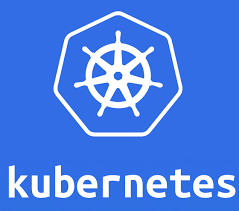

# KUBERNETES CUSTOM OPERATOR PoC

<div style="width: 60%; height: 60%">

  
</div>

Build your own Kubernetes operator!

[](https://opensource.org/licenses/MIT)

## Abstract
From the official Kubernetes <a href="https://kubernetes.io/docs/concepts/extend-kubernetes/operator/">documentation</a>:  
Operators are software extensions to Kubernetes that make use of custom resources to manage applications and their components.
<br/>
Operators follow Kubernetes principles, notably the control loop.
<br/>
<br/>
In this Proof of Concept we will create our custom k8s operator using the <a href="https://github.com/kubernetes-sigs/kubebuilder">kubebuilder</a> framework.
<br/>


## Requirements
- `docker`
- `kind`
- `Go`
- `kubebuilder`
<br/>

## Instructions

First of all we need to have a k8s cluster up and running, for this PoC we will use *kind*:  
```console
kind create cluster --config ./local-dev-cluster/kind-config.yml
```

<br/>

Output:  
```console
Creating cluster "custom-operator-cluster" ...
 ✓ Ensuring node image (kindest/node:v1.25.3) 🖼 
 ✓ Preparing nodes 📦  
 ✓ Writing configuration 📜 
 ✓ Starting control-plane 🕹️ 
 ✓ Installing CNI 🔌 
 ✓ Installing StorageClass 💾 
Set kubectl context to "kind-custom-operator-cluster"
You can now use your cluster with:

kubectl cluster-info --context kind-custom-operator-cluster

Not sure what to do next? 😅  Check out https://kind.sigs.k8s.io/docs/user/quick-start/
```

<br/>

Change kubectl context to use your newly created cluster:
```console
kubectl cluster-info --context kind-custom-operator-cluster

Kubernetes control plane is running at https://127.0.0.1:51652
CoreDNS is running at https://127.0.0.1:51652/api/v1/namespaces/kube-system/services/kube-dns:dns/proxy

To further debug and diagnose cluster problems, use 'kubectl cluster-info dump'.

```

`Note`: this repo already contains the full operator projects so you can skip to the "make manifests" part of the instructions.
<br/>
If you want to start from zero, delete every folder and file except for the `README.md` and follow the instructions step by step.
<br/>

<br/>

Now we can Donwload *kubebuilder* and install it locally.
<br/>
For MacOS:  
```console
brew install kubebuilder
```

<br/>

For Linux:  
```console
curl -L -o kubebuilder https://go.kubebuilder.io/dl/latest/$(go env GOOS)/$(go env GOARCH) \
&& chmod +x kubebuilder && mv kubebuilder /usr/local/bin/
```

<br/>

Check that the installation is ok:  
```console
kubebuilder version

Version: main.version{KubeBuilderVersion:"3.8.0", KubernetesVendor:"unknown", GitCommit:"184ff7465947ced153b031db8de297a778cecf36", BuildDate:"2022-12-02T15:43:53Z", GoOs:"darwin", GoArch:"arm64"}
```
<br/>

Initialise a new project by running the following command. 
<br/>
This will download the controller-runtime binary and scaffold a project that’s ready for us to customise:  
```console
kubebuilder init --domain test.domain --repo test.domain/poc
```

<br/>

Output:  
```console
Writing kustomize manifests for you to edit...
Writing scaffold for you to edit...
Get controller runtime:
$ go get sigs.k8s.io/controller-runtime@v0.13.1
go: downloading sigs.k8s.io/controller-runtime v0.13.1
go: downloading github.com/evanphx/json-patch/v5 v5.6.0
go: downloading k8s.io/apiextensions-apiserver v0.25.0
go: downloading google.golang.org/protobuf v1.28.0
go: downloading github.com/google/go-cmp v0.5.8
go: downloading golang.org/x/text v0.3.7
Update dependencies:
$ go mod tidy
go: downloading go.uber.org/zap v1.21.0
go: downloading github.com/stretchr/testify v1.7.0
go: downloading github.com/Azure/go-autorest/autorest v0.11.27
go: downloading github.com/Azure/go-autorest/autorest/adal v0.9.20
go: downloading go.uber.org/atomic v1.7.0
go: downloading go.uber.org/multierr v1.6.0
go: downloading cloud.google.com/go v0.97.0
go: downloading gopkg.in/check.v1 v1.0.0-20200227125254-8fa46927fb4f
go: downloading github.com/Azure/go-autorest v14.2.0+incompatible
go: downloading github.com/niemeyer/pretty v0.0.0-20200227124842-a10e7caefd8e
go: downloading golang.org/x/crypto v0.0.0-20220315160706-3147a52a75dd
go: downloading github.com/golang-jwt/jwt/v4 v4.2.0
go: downloading github.com/Azure/go-autorest/logger v0.2.1
go: downloading github.com/Azure/go-autorest/autorest/date v0.3.0
go: downloading github.com/Azure/go-autorest/tracing v0.6.0
go: downloading github.com/Azure/go-autorest/autorest/mocks v0.4.2
Next: define a resource with:
$ kubebuilder create api
```

<br/>

The `config` folder contains the manifests to deploy the operator in Kubernetes.
<br/>
The `main.go` file contains our operator's logic.
<br/>

As the output from the previous command suggests, we can go on and create a new API and a new Custom Resource Definition:  (select 'y' when requested):  
```console
kubebuilder create api --group poc --version v1 --kind MyCustomResource
```

<br/>

The previous command creates 2 folders:  
- `api/v1` → contains our `MyCustomResource` *CRD*
- `controllers` → contains the `MyCustomResource` controller

<br/>

Now we need to modify two file to implement our custom logics:  
`mycustomresource_types.go`
```go
package v1

import (
	metav1 "k8s.io/apimachinery/pkg/apis/meta/v1"
)

// MyCustomResourceSpec defines the desired state of MyCustomResource
type MyCustomResourceSpec struct {
	// Name of the friend MyCustomResource is looking for
	Name string `json:"name"`
}

// MyCustomResourceStatus defines the observed state of MyCustomResource
type MyCustomResourceStatus struct {
	// Healthy will be set to true if MyCustomResource found a friend
	Healthy bool `json:"Healthy,omitempty"`
}

//+kubebuilder:object:root=true
//+kubebuilder:subresource:status

// MyCustomResource is the Schema for the MyCustomResources API
type MyCustomResource struct {
	metav1.TypeMeta   `json:",inline"`
	metav1.ObjectMeta `json:"metadata,omitempty"`

	Spec   MyCustomResourceSpec   `json:"spec,omitempty"`
	Status MyCustomResourceStatus `json:"status,omitempty"`
}

//+kubebuilder:object:root=true

// MyCustomResourceList contains a list of MyCustomResource
type MyCustomResourceList struct {
	metav1.TypeMeta `json:",inline"`
	metav1.ListMeta `json:"metadata,omitempty"`
	Items           []MyCustomResource `json:"items"`
}

func init() {
	SchemeBuilder.Register(&MyCustomResource{}, &MyCustomResourceList{})
}

```


<br>
<br/>

`mycustomresource_controller.go`
```go
package controllers

import (
	"context"

	corev1 "k8s.io/api/core/v1"
	"k8s.io/apimachinery/pkg/runtime"
	"k8s.io/apimachinery/pkg/types"
	ctrl "sigs.k8s.io/controller-runtime"
	"sigs.k8s.io/controller-runtime/pkg/client"
	"sigs.k8s.io/controller-runtime/pkg/handler"
	"sigs.k8s.io/controller-runtime/pkg/log"
	"sigs.k8s.io/controller-runtime/pkg/reconcile"
	"sigs.k8s.io/controller-runtime/pkg/source"

	tutorialv1 "test.domain/poc/api/v1"
)

// MyCustomResourceReconciler reconciles a MyCustomResource object
type MyCustomResourceReconciler struct {
	client.Client
	Scheme *runtime.Scheme
}

// RBAC permissions to monitor MyCustomResource custom resources
//+kubebuilder:rbac:groups=tutorial.my.domain,resources=MyCustomResources,verbs=get;list;watch;create;update;patch;delete
//+kubebuilder:rbac:groups=tutorial.my.domain,resources=MyCustomResources/status,verbs=get;update;patch
//+kubebuilder:rbac:groups=tutorial.my.domain,resources=MyCustomResources/finalizers,verbs=update

// RBAC permissions to monitor pods
//+kubebuilder:rbac:groups="",resources=pods,verbs=get;list;watch

// Reconcile is part of the main kubernetes reconciliation loop which aims to
// move the current state of the cluster closer to the desired state.
func (r *MyCustomResourceReconciler) Reconcile(ctx context.Context, req ctrl.Request) (ctrl.Result, error) {
	log := log.FromContext(ctx)
	log.Info("reconciling MyCustomResource custom resource")

	// Get the MyCustomResource resource that triggered the reconciliation request
	var MyCustomResource tutorialv1.MyCustomResource
	if err := r.Get(ctx, req.NamespacedName, &MyCustomResource); err != nil {
		log.Error(err, "unable to fetch MyCustomResource")
		return ctrl.Result{}, client.IgnoreNotFound(err)
	}

	// Get pods with the same name as MyCustomResource's friend
	var podList corev1.PodList
	var friendFound bool
	if err := r.List(ctx, &podList); err != nil {
		log.Error(err, "unable to list pods")
	} else {
		for _, item := range podList.Items {
			if item.GetName() == MyCustomResource.Spec.Name {
				log.Info("pod linked to a MyCustomResource custom resource found", "name", item.GetName())
				friendFound = true
			}
		}
	}

	// Update MyCustomResource' Healthy status
	MyCustomResource.Status.Healthy = friendFound
	if err := r.Status().Update(ctx, &MyCustomResource); err != nil {
		log.Error(err, "unable to update MyCustomResource's Healthy status", "status", friendFound)
		return ctrl.Result{}, err
	}
	log.Info("MyCustomResource's Healthy status updated", "status", friendFound)

	log.Info("MyCustomResource custom resource reconciled")
	return ctrl.Result{}, nil
}

// SetupWithManager sets up the controller with the Manager.
func (r *MyCustomResourceReconciler) SetupWithManager(mgr ctrl.Manager) error {
	return ctrl.NewControllerManagedBy(mgr).
		For(&tutorialv1.MyCustomResource{}).
		Watches(
			&source.Kind{Type: &corev1.Pod{}},
			handler.EnqueueRequestsFromMapFunc(r.mapPodsReqToMyCustomResourceReq),
		).
		Complete(r)
}

func (r *MyCustomResourceReconciler) mapPodsReqToMyCustomResourceReq(obj client.Object) []reconcile.Request {
	ctx := context.Background()
	log := log.FromContext(ctx)

	// List all the MyCustomResource custom resource
	req := []reconcile.Request{}
	var list tutorialv1.MyCustomResourceList
	if err := r.Client.List(context.TODO(), &list); err != nil {
		log.Error(err, "unable to list MyCustomResource custom resources")
	} else {
		// Only keep MyCustomResource custom resources related to the Pod that triggered the reconciliation request
		for _, item := range list.Items {
			if item.Spec.Name == obj.GetName() {
				req = append(req, reconcile.Request{
					NamespacedName: types.NamespacedName{Name: item.Name, Namespace: item.Namespace},
				})
				log.Info("pod linked to a MyCustomResource custom resource issued an event", "name", obj.GetName())
			}
		}
	}
	return req
}

```

<br/>

Here we are basically telling our custom resource to update his status to `Healthy=true`  when it founds a pod with the same name as the resource.

<br/>


Update the operator manifests:  
```console
make manifests
```

<br/>

Install the CRDs into the cluster:  
```console
make install
```

<br/>

Check if the resource creation is ok:  
```console
kubectl get crds

NAME                                CREATED AT
mycustomresources.poc.test.domain   2023-01-13T10:50:58Z
```

<br/>

Now we can run our controller:  
```console
make run
```

<br/>

Open a new terminal (the previous command in blocking) and apply your resources:  
```console
kubectl apply -f config/samples

mycustomresource.poc.test.domain/my-custom-resource-01 created
mycustomresource.poc.test.domain/my-custom-resource-02 created
```

<br/>

Now lets create a pod that have the same name as our `my-custom-resource-01`:  
```console
cat <<EOF | kubectl apply -f -
apiVersion: v1
kind: Pod
metadata:
  name: funny-joe
spec:
  containers:
  - name: ubuntu
    image: ubuntu:latest
    # Just sleep forever
    command: [ "sleep" ]
    args: [ "infinity" ]
EOF
```
<br/>

If we go back to our main terminal we can see that our action triggered a reconciliation in our controller:  
```console
1.6736079596526442e+09  INFO    pod linked to a MyCustomResource custom resource issued an event        {"name": "funny-joe"}
1.673607959652718e+09   INFO    reconciling MyCustomResource custom resource    {"controller": "mycustomresource", "controllerGroup": "poc.test.domain", "controllerKind": "MyCustomResource", "MyCustomResource": {"name":"my-custom-resource-01","namespace":"default"}, "namespace": "default", "name": "my-custom-resource-01", "reconcileID": "a764d08b-1378-4391-a2f4-1dce00bd39bf"}
1.673607959652889e+09   INFO    pod linked to a MyCustomResource custom resource found  {"controller": "mycustomresource", "controllerGroup": "poc.test.domain", "controllerKind": "MyCustomResource", "MyCustomResource": {"name":"my-custom-resource-01","namespace":"default"}, "namespace": "default", "name": "my-custom-resource-01", "reconcileID": "a764d08b-1378-4391-a2f4-1dce00bd39bf", "name": "funny-joe"}
1.6736079596596322e+09  INFO    MyCustomResource's Healthy status updated       {"controller": "mycustomresource", "controllerGroup": "poc.test.domain", "controllerKind": "MyCustomResource", "MyCustomResource": {"name":"my-custom-resource-01","namespace":"default"}, "namespace": "default", "name": "my-custom-resource-01", "reconcileID": "a764d08b-1378-4391-a2f4-1dce00bd39bf", "status": true}
1.6736079596597362e+09  INFO    MyCustomResource custom resource reconciled     {"controller": "mycustomresource", "controllerGroup": "poc.test.domain", "controllerKind": "MyCustomResource", "MyCustomResource": {"name":"my-custom-resource-01","namespace":"default"}, "namespace": "default", "name": "my-custom-resource-01", "reconcileID": "a764d08b-1378-4391-a2f4-1dce00bd39bf"}
```

<br/>

If we describe our resource we can see that the status has been set to "Healthy: true":  
```console
❯ kubectl describe MyCustomresource my-custom-resource-01

Name:         my-custom-resource-01
Namespace:    default
Labels:       <none>
Annotations:  <none>
API Version:  poc.test.domain/v1
Kind:         MyCustomResource
Metadata:
  Creation Timestamp:  2023-01-13T10:58:44Z
  Generation:          2
  Managed Fields:
    API Version:  poc.test.domain/v1
    Fields Type:  FieldsV1
    fieldsV1:
      f:metadata:
        f:annotations:
          .:
          f:kubectl.kubernetes.io/last-applied-configuration:
      f:spec:
        .:
        f:name:
    Manager:      kubectl-client-side-apply
    Operation:    Update
    Time:         2023-01-13T11:05:21Z
    API Version:  poc.test.domain/v1
    Fields Type:  FieldsV1
    fieldsV1:
      f:status:
        .:
        f:Healthy:
    Manager:         main
    Operation:       Update
    Subresource:     status
    Time:            2023-01-13T11:05:45Z
  Resource Version:  3162
  UID:               484279fd-b81e-43a8-9430-3d16085d3425
Spec:
  Name:  funny-joe
Status:
  Healthy:  true
Events:     <none>
```

<br/>

Now delete the pod and re-check the state of our resource:  
```console
k delete pods funny-joe && k describe MyCustomresource my-custom-resource-01

pod "funny-joe" deleted
Name:         my-custom-resource-01
Namespace:    default
Labels:       <none>
Annotations:  <none>
API Version:  poc.test.domain/v1
Kind:         MyCustomResource
Metadata:
  Creation Timestamp:  2023-01-13T10:58:44Z
  Generation:          2
  Managed Fields:
    API Version:  poc.test.domain/v1
    Fields Type:  FieldsV1
    fieldsV1:
      f:metadata:
        f:annotations:
          .:
          f:kubectl.kubernetes.io/last-applied-configuration:
      f:spec:
        .:
        f:name:
    Manager:      kubectl-client-side-apply
    Operation:    Update
    Time:         2023-01-13T11:05:21Z
    API Version:  poc.test.domain/v1
    Fields Type:  FieldsV1
    fieldsV1:
      f:status:
    Manager:         main
    Operation:       Update
    Subresource:     status
    Time:            2023-01-13T11:05:45Z
  Resource Version:  3772
  UID:               484279fd-b81e-43a8-9430-3d16085d3425
Spec:
  Name:  funny-joe
Status:
Events:  <none>
```

<br/>

You can repeat the same flow also for the second MyCustomResource and see how it's status change.

<br/>


